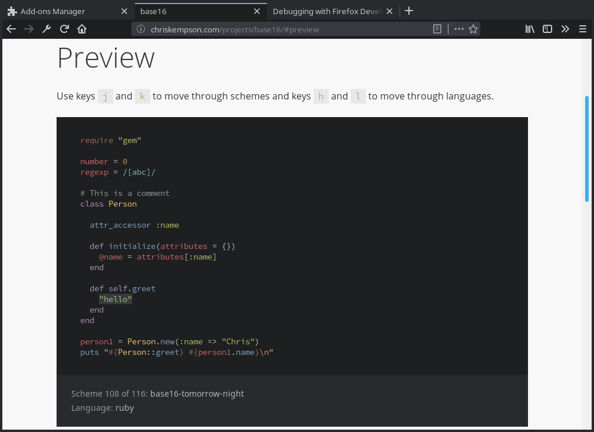

# base16-firefox

[base16][1] themes for [Mozilla Firefox][2]. Using [WebExtensions Themes][3].

Example screenshot with [Tomorrow Night][4] by [chriskempson][5]

## Building

1. Populate working directory with `sources.yaml`
1. Use a [builder][6], update colour schemes and add base16-firefox to the templates build
1. Use a builder to generate the theme files inside the firefox folder, e.g.

       pybase16 build -o templates/firefox/ext/

1. Build the WebExtension, either manually or with [`web-ext`][7] (`web-ext build -s ext`)

## Usage

1. Load extension temporarily via `about:debugging` or via `about:addons` (if signed)
or
1. Install from [AMO][8]
1. Navigate to `about:addons`, open the preferences for `base16` and select your theme.

## Known issues

While the WebExtension stores the theme in its local storage, and it should automatically reload the theme on Firefox restart, it will not be represented in the preferences page. The selector will initially always show the first entry.

[1]: http://chriskempson.com/projects/base16/
[2]: https://www.mozilla.org/firefox/
[3]: https://developer.mozilla.org/en-US/Add-ons/WebExtensions/manifest.json/theme
[4]: https://github.com/chriskempson/base16-tomorrow-scheme
[5]: https://github.com/chriskempson
[6]: https://github.com/chriskempson/base16#builder-repositories
[7]: https://developer.mozilla.org/en-US/Add-ons/WebExtensions/Getting_started_with_web-ext
[8]: https://addons.mozilla.org/firefox/addon/base16/
[9]: https://hacks.mozilla.org/2018/07/dark-theme-darkening-better-theming-for-firefox-quantum/
